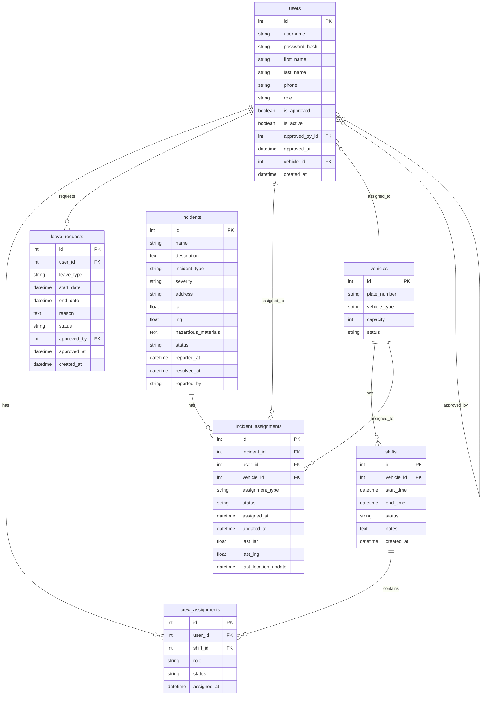

I will integrate the Mermaid ER diagram into the `README.md` file. The updated file includes a new **Database Schema** section with the diagram.

---

### Updated `README.md` (with ER diagram)

md
# ГДПБЗН – Информационна система за управление на произшествия

## Incident Management Information System for the Fire Department

---

## 📋 Description

The information system is developed for the **General Directorate "Fire Safety and Protection of the Population" (GDPBZN)** under the Ministry of Interior of Bulgaria. The system supports the operational work of firefighters through incident management, crew coordination, vehicle tracking, and personnel administration.

---

## 🚀 Technology Stack

| Component | Technology |
|-----------|------------|
| Backend | Python 3.11, Flask 3.1.3 |
| ORM | SQLAlchemy 3.1.1, Flask-SQLAlchemy |
| Database | PostgreSQL 15 |
| Containerization | Podman / Docker |
| Frontend | HTML5, CSS3, JavaScript (vanilla) |
| Maps | Leaflet.js + OpenStreetMap |
| Authentication | Flask sessions, bcrypt hashing |

---

## 📁 Project Structure

```
├── app/
│   ├── __init__.py          # Flask application factory
│   ├── models.py            # SQLAlchemy models
│   ├── routes/
│   │   ├── auth.py          # Registration, login, logout
│   │   └── main.py          # Core routes (dashboard, map, incidents, admin)
│   ├── static/
│   │   ├── css/
│   │   │   ├── base.css     # Base styles, navigation, footer, responsive
│   │   │   ├── auth.css     # Login and registration styles
│   │   │   ├── admin.css    # Admin dashboard styles
│   │   │   └── components.css # Reusable components (buttons, flash messages)
│   │   └── js/
│   │       └── main.js      # Hamburger menu, user dropdown interactions
│   └── templates/
│       ├── index.html
│       ├── dashboard.html
│       ├── map.html
│       ├── SignIn.html
│       ├── SignUp.html
│       ├── incident_form.html
│       ├── incident_detail.html
│       ├── admin_dashboard.html
│       └── user_edit.html
├── run.py                   # Entry point
├── config.py                # Configuration (DB, SECRET_KEY)
├── requirements.txt         # Dependencies
├── docker-compose.yaml      # Container orchestration
├── Dockerfile               # Docker image for the Flask app
└── README.md                # This file
```

---

## 🗄️ Database Schema

The database consists of the following tables and relationships. The diagram below is generated using Mermaid.


### Relationship Summary

| Relationship | Description |
|--------------|-------------|
| `users` → `vehicles` | A user can be assigned to one vehicle; a vehicle can have many users. |
| `users` → `users` (self) | The `approved_by_id` references the admin who approved the user. |
| `vehicles` → `shifts` | A vehicle can have many shifts; each shift belongs to one vehicle. |
| `shifts` → `crew_assignments` | A shift can have many crew assignments; each assignment belongs to one shift. |
| `users` → `crew_assignments` | A user can have many crew assignments; each assignment belongs to one user. |
| `users` → `leave_requests` | A user can have many leave requests; each request belongs to one user. |
| `users` → `incident_assignments` | A user can be assigned to many incidents; each assignment belongs to one user. |
| `vehicles` → `incident_assignments` | A vehicle can be assigned to many incidents; each assignment belongs to one vehicle. |
| `incidents` → `incident_assignments` | An incident can have many assignments; each assignment belongs to one incident. |

---

## ⚙️ Installation and Setup

### Requirements

- Podman (or Docker)
- Podman-compose (or Docker Compose)

### Steps

1. **Clone the repository**

   ```bash
   git clone <repository-url>
   cd iara-gdbpzn-ddzavalishin23
   ```

2. **Start the containers**

   Using Podman:

   ```bash
   podman-compose up -d --build
   ```

   Or using Docker:

   ```bash
   docker-compose up -d --build
   ```

3. **Create an admin account**

   ```bash
   podman-compose exec web flask shell
   ```

   ```python
   from app import db
   from app.models import User

   admin = User(
       username='admin',
       first_name='Denis',
       last_name='Zavalishin',
       phone='0888888888',
       role='admin',
       is_approved=True,
       is_active=True
   )
   admin.set_password('admin123')
   db.session.add(admin)
   db.session.commit()
   exit()
   ```

4. **Access the application**

   Open your browser at: **`http://localhost:5000`**

---

## 🔑 Test Accounts

| Username | Password | Role |
|----------|----------|------|
| `admin` | `admin123` | Administrator |
| `operator` | `pass123` | Operator |
| `ivan.petrov` | `fire123` | Firefighter (pending approval) |
| `georgi.dimitrov` | `fire123` | Firefighter (pending approval) |
| `petar.stoyanov` | `fire123` | Firefighter (pending approval) |
| `nikolay.ivanov` | `fire123` | Firefighter (pending approval) |
| `dimitri.todorov` | `fire123` | Firefighter (pending approval) |

---

## 📊 Key Features

### User Roles

| Role | Permissions |
|------|-------------|
| **Firefighter** | View dashboard, map, profile. Receives notifications for new incidents. |
| **Operator** | All firefighter permissions + create new incidents. |
| **Administrator** | All operator permissions + approve users, create/edit vehicles, reassign/remove users, edit user data. |

### Incident Management

- Create new incidents with GPS coordinates (click on the map)
- Dispatch crews and vehicles
- Mark incidents as resolved
- Map view with all active incidents
- Detailed incident view with assigned teams

### Admin Features

- Approve new users
- Assign users to vehicles
- Create new vehicles
- Edit user data (name, phone, role, vehicle, status, password)
- Reassign users between vehicles
- Deactivate users

---

## 🔧 Configuration

### Environment Variables

| Variable | Description | Default |
|----------|-------------|---------|
| `RUNNING_IN_CONTAINER` | Whether the app runs in a container | `true` |
| `POSTGRES_USER` | Database user | `gdpbzn_user` |
| `POSTGRES_PASSWORD` | Database password | `your_password` |
| `POSTGRES_DB` | Database name | `gdpbzn_db` |
| `SECRET_KEY` | Session secret key | `dev-secret-key` |

---

## 🐛 Common Issues and Solutions

### 1. `connection to server at "db" failed: Connection refused`

**Solution:** Wait a few seconds and restart the web container:

```bash
podman-compose restart web
```

### 2. `Permission denied` on startup

**Solution:** Add `:Z` to volume mounts in `docker-compose.yaml` or run:

```bash
chmod 644 app/templates/*.html
```

### 3. `UndefinedColumn: column users.is_approved does not exist`

**Solution:** Add missing columns manually:

```bash
podman-compose exec db psql -U gdpbzn_user -d gdpbzn_db -c "
ALTER TABLE users ADD COLUMN IF NOT EXISTS is_approved BOOLEAN DEFAULT false NOT NULL;
ALTER TABLE users ADD COLUMN IF NOT EXISTS is_active BOOLEAN DEFAULT true NOT NULL;
ALTER TABLE users ADD COLUMN IF NOT EXISTS approved_by_id INTEGER REFERENCES users(id);
ALTER TABLE users ADD COLUMN IF NOT EXISTS approved_at TIMESTAMP;
ALTER TABLE users ADD COLUMN IF NOT EXISTS vehicle_id INTEGER REFERENCES vehicles(id);
"
```

### 4. `TemplateNotFound: incident_form.html`

**Solution:** Check that the file exists in `app/templates/`.

### 5. `AssertionError: View function mapping is overwriting...`

**Solution:** Review `auth.py` and `main.py` for duplicate route definitions and remove them.

---

## 📚 Documentation

Full documentation is available in both Bulgarian and English. Contact the developer for more details.

---

## 🤝 Contributing

1. Fork the repository
2. Create a feature branch (`git checkout -b feature/amazing-feature`)
3. Commit your changes (`git commit -m 'Add some amazing feature'`)
4. Push to the branch (`git push origin feature/amazing-feature`)
5. Open a Pull Request

---

## 📄 License

This project is developed for educational purposes and is the property of **GDPBZN – Burgas**.

---

## 👤 Contact

**Developer:** Denis Zavalishin  
**Organization:** RDPBZN – Burgas  
**Email:** (upon request)  
**Phone:** (upon request)

---

*Last updated: July 2026*
```

---

## How to use

1. Replace your current `README.md` with the content above.
2. The Mermaid diagram will render automatically on GitHub, GitLab, or any platform that supports Mermaid.
3. If you are viewing it locally, you can use a Mermaid live editor or a VS Code extension.

---

The diagram is now fully integrated into the documentation, providing a clear visual overview of the database structure and relationships.
